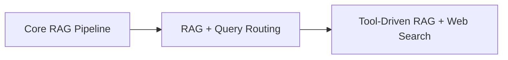

# AI Learning Lab

A collection of projects, focused implementations, and hands-on exercises documenting my exploration of AI engineering.

The repository covers concepts including:

- OpenAI Responses API
- Prompt and context engineering
- Tool calling and agentic workflows
- Retrieval-Augmented Generation (RAG)
- Vector embeddings and semantic search
- Model Context Protocol (MCP)
- Open-source models
- Local inference
- Computer vision
- Streaming AI responses
- LLM context-window management

## Repository Structure

The repository is organized into three areas:

### Projects

Standalone applications that bring multiple AI engineering concepts together into a more complete experience.

<table>
  <thead>
    <tr>
      <th>Project</th>
      <th>What It Demonstrates</th>
    </tr>
  </thead>
  <tbody>
    <tr>
      <td>🎁 <a href="projects/gift-genie/README.md"><strong>Gift Genie — AI Gift Recommendation Assistant</strong></a></td>
      <td>OpenAI Responses API, web search, system prompt design, structured model output, streaming, and Server-Sent Events</td>
    </tr>
  </tbody>
</table>

#### Gift Genie

An AI-powered assistant that generates personalized gift recommendations based on the recipient, occasion, budget, location, and other constraints.

It combines the **OpenAI Responses API** with web search to retrieve current information and streams generated recommendations to the browser in real time.

[**View Project →**](projects/gift-genie/README.md)

---

### Scrims

Focused implementations used to explore individual AI engineering concepts in depth.

Although narrower in scope than the standalone projects, these scrims are practical implementations of important patterns such as local inference, agent tool use, context-window management, Retrieval-Augmented Generation, and MCP-based AI integrations.

#### Open-Source Models

<table>
  <thead>
    <tr>
      <th>Scrim</th>
      <th>What It Demonstrates</th>
    </tr>
  </thead>
  <tbody>
    <tr>
      <td>👁️ <a href="scrims/03-open-source-models/01-object-detection/README.md"><strong>Object Detection with Transformers.js</strong></a></td>
      <td>Open-source computer vision, Hugging Face Transformers.js, YOLOS Tiny, and local browser inference</td>
    </tr>
    <tr>
      <td>🦙 <a href="scrims/03-open-source-models/02-ollama-hello-world/README.md"><strong>Running an LLM Locally with Ollama</strong></a></td>
      <td>Running Mistral locally with Ollama and integrating a local LLM with Node.js</td>
    </tr>
  </tbody>
</table>

#### AI Agents

<table>
  <thead>
    <tr>
      <th>Scrim</th>
      <th>What It Demonstrates</th>
    </tr>
  </thead>
  <tbody>
    <tr>
      <td>🤖 <a href="scrims/05-agents/README.md"><strong>OpenAI Function Agent</strong></a></td>
      <td>Agentic workflows, OpenAI Responses API, function/tool calling, and external API integration</td>
    </tr>
  </tbody>
</table>

#### Context Engineering

<table>
  <thead>
    <tr>
      <th>Scrim</th>
      <th>What It Demonstrates</th>
    </tr>
  </thead>
  <tbody>
    <tr>
      <td>✂️ <a href="scrims/06-context-engineering/01-context-trimming/README.md"><strong>LLM Context Trimming</strong></a></td>
      <td>Token counting, context budgets, and trimming older conversation history before model requests</td>
    </tr>
    <tr>
      <td>🧠 <a href="scrims/06-context-engineering/02-context-summarization/README.md"><strong>LLM Context Summarization</strong></a></td>
      <td>Summarization-based context compaction, token-budget design, and separation of UI conversation state from model context</td>
    </tr>
  </tbody>
</table>

#### RAG & Vercel AI SDK

A progression from a conventional RAG pipeline to increasingly flexible approaches for deciding when and how external information should be used.

<table>
  <thead>
    <tr>
      <th>Scrim</th>
      <th>What It Demonstrates</th>
    </tr>
  </thead>
  <tbody>
    <tr>
      <td>📚 <a href="scrims/07-vercel-ai-sdk/01-rag-using-openai-sdk/README.md"><strong>RAG with the OpenAI SDK</strong></a></td>
      <td>Document ingestion, chunking, embeddings, Supabase + pgvector vector search, semantic retrieval, and grounded generation</td>
    </tr>
    <tr>
      <td>🧭 <a href="scrims/07-vercel-ai-sdk/02-rag-with-query-routing/README.md"><strong>RAG with Query Routing using Vercel AI SDK</strong></a></td>
      <td>Structured query classification, selective retrieval, Vercel AI SDK, embeddings, and vector similarity search</td>
    </tr>
    <tr>
      <td>🛠️ <a href="scrims/07-vercel-ai-sdk/03-tool-driven-rag-with-web-search/README.md"><strong>Tool-Driven RAG with Web Search using Vercel AI SDK</strong></a></td>
      <td>Model-driven tool selection across a private RAG knowledge base, web search, and direct model responses</td>
    </tr>
  </tbody>
</table>

The three implementations intentionally build on one another:

The progression explores moving from a fixed retrieval pipeline, to application-level routing, and finally to a tool-driven approach where the model can choose between private knowledge, live web information, or answering directly.

#### Model Context Protocol

<table>
  <thead>
    <tr>
      <th>Scrim</th>
      <th>What It Demonstrates</th>
    </tr>
  </thead>
  <tbody>
    <tr>
      <td>🔌 <a href="scrims/08-mcp-server/README.md"><strong>MCP Server for AI Clients</strong></a></td>
      <td>Building an MCP server from scratch, exposing tools and resources, stdio transport, structured tool inputs, MCP Inspector testing, and integration with ChatGPT Codex</td>
    </tr>
  </tbody>
</table>

---

### Exercises

Smaller hands-on exercises used to explore APIs and AI engineering concepts individually before applying them in larger implementations.

These include experimentation with:

- [**Introduction to AI APIs**](exercises/01-intro-to-ai/) — chat completions, message roles, system prompts, streaming, structured output, web search, and the Responses API
- [**Open-Source Models**](exercises/03-open-source-models/) — working with openly available models and model tooling
- [**Embeddings**](exercises/04-embeddings/) — representing and working with semantic information
- [**Agents**](exercises/05-agents/) — tool use and agentic execution patterns
- [**Vercel AI SDK**](exercises/07-vercel-ai-sdk/) — embeddings, batch embeddings, structured output, tool calling, and web search

The exercises intentionally remain smaller and more focused than the projects and scrims, serving as a working lab for understanding individual concepts.

## References

Most of the learning in this repository follows [Scrimba's AI Engineer Path](https://scrimba.com/ai-engineer-path-c02v), with additional experimentation and implementation work as I explore how modern AI capabilities can be integrated into real applications.
