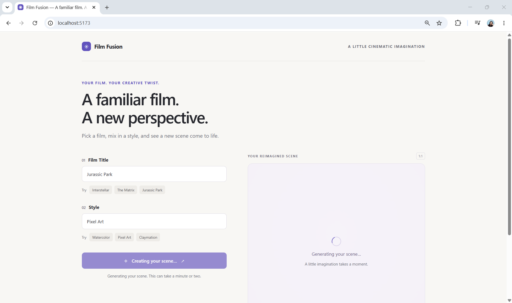
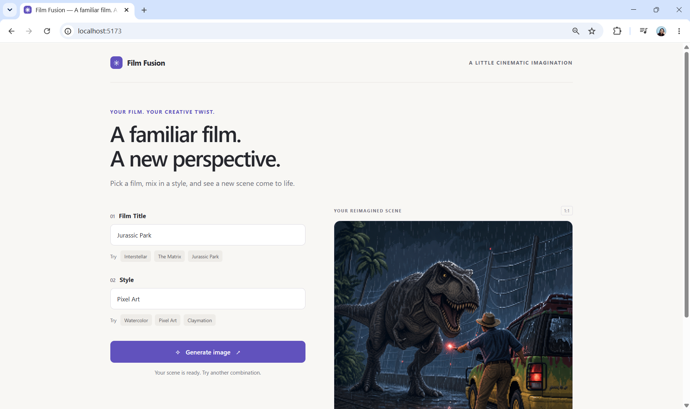
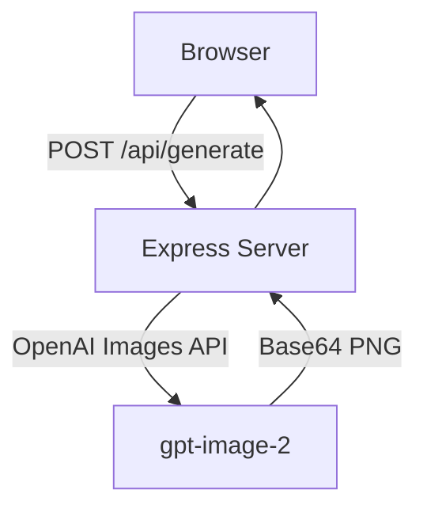

# Film Fusion

An AI-powered visual remix experience that reimagines familiar films in entirely different artistic styles.

Enter a **film title** and a **visual style**, and Film Fusion uses OpenAI image generation to create an original scene that blends the atmosphere and themes of the film with the selected aesthetic.

For example:

- _Interstellar_ in watercolor
- _The Matrix_ in Studio Ghibli-inspired animation
- _Blade Runner_ as an oil painting
- _The Godfather_ in cyberpunk style




## Architecture

Film Fusion separates the browser UI from the AI integration.



The OpenAI API key stays on the server and is never exposed to frontend code.

During local development, Vite runs on port `5173` and proxies `/api` requests to the Express server on port `3000`.

### Error Handling

Image generation can take significantly longer than a normal API request, so the application includes explicit handling for common failure scenarios.

These include:

- invalid or empty input
- malformed requests
- image generation timeouts
- content moderation failures
- API rate limits
- authentication or model-access errors
- missing image responses
- browser image-loading failures

The UI preserves the user's inputs when generation fails so they can retry without starting over.

## Running Locally

### 1. Create an OpenAI API key

Create an API key from the [OpenAI Platform](https://platform.openai.com/) and make sure your API account has billing or credits available.

You will also need access to an OpenAI image-generation model.

### 2. Install dependencies

```bash
npm install
```

### 3. Configure the environment

Create a `.env` file in the project directory:

```env
OPENAI_API_KEY=your_openai_api_key
```

### 4. Start the application

```bash
npm start
```

This starts both:

- the Express API server at `http://localhost:3000`
- the Vite frontend at `http://localhost:5173`

Open:

```text
http://localhost:5173
```

Then enter a film title and a visual style to generate a scene.
