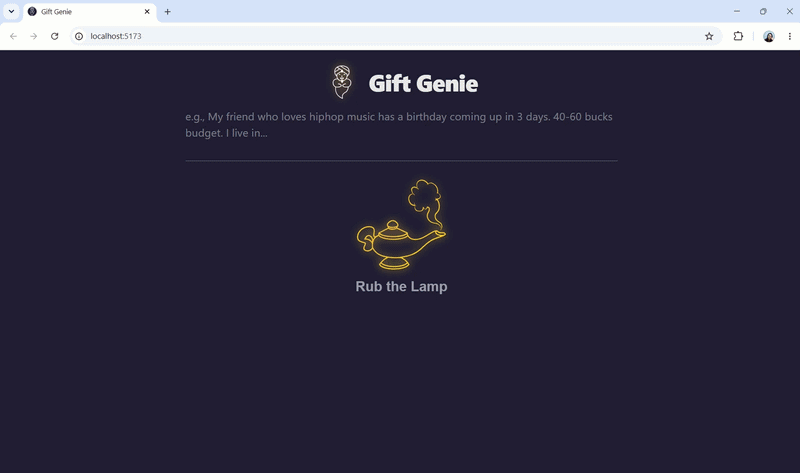

# Gift Genie — AI Gift Recommendation Assistant

An AI-powered assistant that generates personalized gift recommendations based on recipient, occasion, budget, location, and other constraints.

Built with the OpenAI Responses API and web search to retrieve current information, with responses streamed to the browser using Server-Sent Events.

## AI Engineering Concepts Demonstrated

- OpenAI Responses API
- LLM web-search tool use
- System prompt design
- Streaming generation
- Server-Sent Events
- Error handling for streamed model responses
- Structured model output

## Running Locally

1. Create an OpenAI API key from the [OpenAI API Platform](https://platform.openai.com/).
2. Make sure the OpenAI API account has credits available.
3. Install dependencies: `npm i`
4. Create a `.env` file.
   ```
   AI_URL=https://api.openai.com/v1
   AI_MODEL=your_preferred_openai_model
   AI_KEY=your_openai_api_key
   ```
5. Start the application: `npm start`


