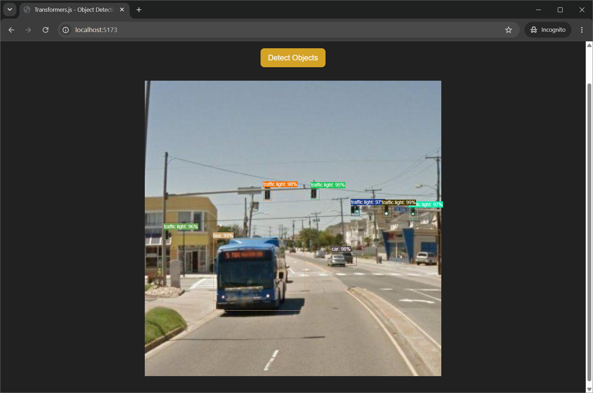
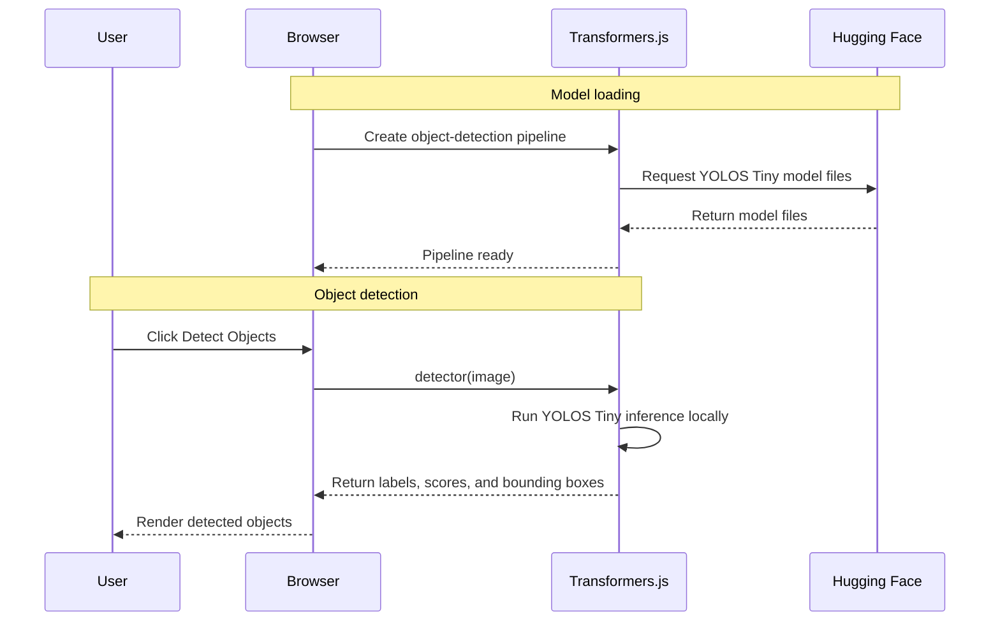

# Object Detection with Transformers.js

A browser-based computer vision demo that performs **local inference** using an open-source object detection model from Hugging Face.

The project demonstrates how a complex AI capability such as identifying multiple objects and locating them within an image can be integrated into a JavaScript application with only a small amount of code.

The model is loaded using **Transformers.js**, while inference runs directly in the user's browser rather than through a hosted AI inference API.

## What This Demonstrates

- **Open-source AI models** from Hugging Face
- **Local inference** in the browser
- **Computer vision** through object detection
- **Transformers.js pipelines** for high-level model integration
- Rendering predictions as **bounding boxes and confidence scores**



## Architecture



This distinction is important:

- The **model files are downloaded from Hugging Face**
- The **inference itself runs locally in the browser**
- The image is **not sent to a hosted AI inference API**

## Running Locally

Install the dependencies:

```bash
npm install
```

Start the development server:

```bash
npm start
```

Then open the local Vite URL displayed in the terminal.

An internet connection is required to download the model files from Hugging Face when they are not already cached by the browser.
