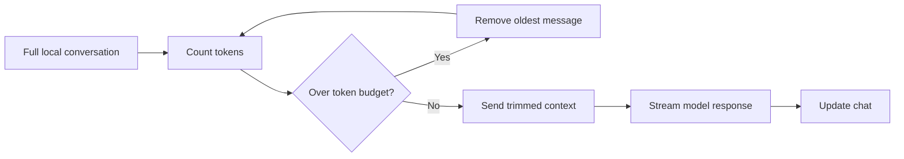

# LLM Context Trimming

A small chat app for demonstrating one practical LLM constraint: a model can only receive as much conversation history as fits inside its context window.

The app starts with a long seeded conversation, lets the user continue chatting, then trims older messages before each model request. The full conversation remains in the browser state, but only the trimmed context is sent to the model.



## Setup

Install dependencies:

```bash
npm install
```

Create an account at [OpenRouter](https://openrouter.ai/), generate an API key, then create a `.env` file in the project root:

```bash
OPENROUTER_KEY=your_openrouter_api_key
MODEL_ID=provider/model-id-with-16k-or-33k-context
```

Use a **16k or 33k context model** because the seeded conversation is intentionally long. The app trims outgoing context to about 10k tokens by default, leaving room for instructions and the model's response.

Run the app:

```bash
npm run dev
```

> [!WARNING]  
> This is a learning exercise, so the OpenRouter key is exposed through the Vite client environment. In a production app, model calls should go through a backend endpoint so API keys stay server-side.
