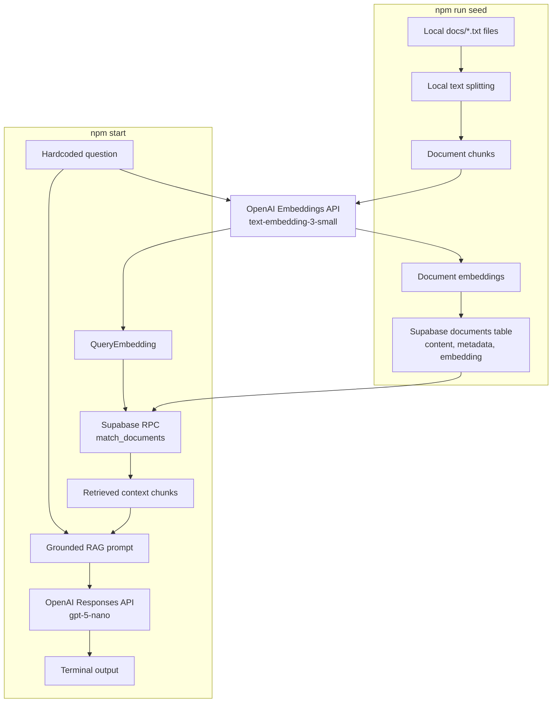

# RAG with the OpenAI SDK

This demonstrates the core retrieval-augmented generation flow across a multi-file corpus: ingest local text files, split them into chunks, create hosted OpenAI embeddings, store the embedded chunks in Supabase, retrieve semantically similar chunks for a query, and send the retrieved context to a hosted OpenAI generation model.

## How It Works



## Running Locally

1. Create an OpenAI API key from the [OpenAI API Platform](https://platform.openai.com/). Make sure the account has credits available.
2. Create a [Supabase project](https://supabase.com/), and execute the following queries:
   1. [Create Table](sql/01-set-up.sql)
   2. [match_documents Function](sql/02-match-documents.sql)
3. Create a `.env` file with:
   ```bash
   OPENAI_API_KEY=your_openai_api_key
   SUPABASE_URL=your_supabase_project_url
   SUPABASE_API_KEY=your_supabase_api_key
   ```
4. Install dependencies: `npm install`
5. Seed the vector store: `npm run seed`
6. Run the sample query: `npm start`
