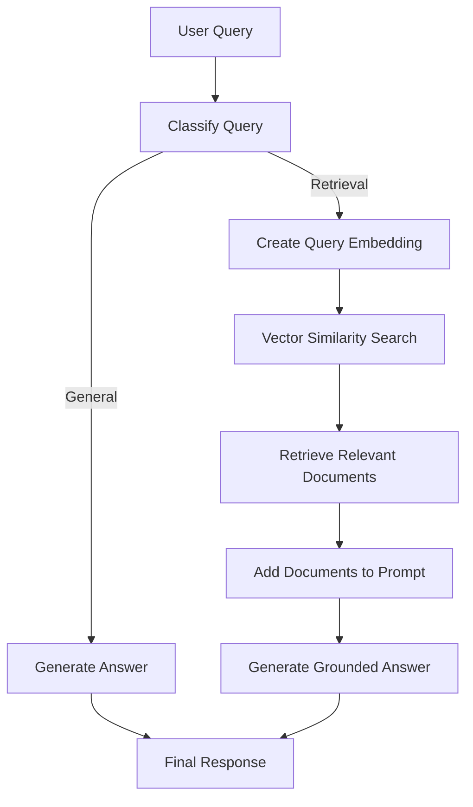
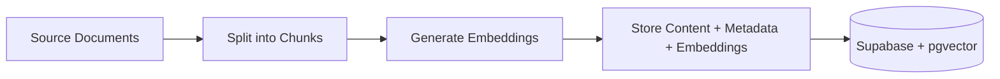

# RAG with Query Routing using Vercel AI SDK

A Retrieval-Augmented Generation (RAG) implementation that uses **query classification to decide when retrieval is actually needed**.

Built with the **Vercel AI SDK**, OpenAI models, Supabase, and pgvector, the application routes each question through one of two paths:

- **General query** → answer directly with the LLM
- **Retrieval query** → retrieve relevant documents first, then generate an answer using the retrieved context

This avoids running vector search for every request and demonstrates a simple but useful routing pattern for RAG applications.

## What This Demonstrates

- Retrieval-Augmented Generation (RAG)
- Query classification and routing
- Vercel AI SDK
- Structured model output
- OpenAI embeddings
- Vector similarity search with pgvector
- Supabase as a vector store
- Document chunking and ingestion
- Separating retrieval from generation

## Architecture



The routing decision is produced using structured output from the Vercel AI SDK. Questions related to the indexed Scrimba documentation are classified as `retrieval`, while unrelated general-knowledge questions are answered directly.

## RAG Flow

For retrieval queries, the application:

1. Converts the user's query into an embedding using `text-embedding-3-small`.
2. Sends the embedding to a Supabase PostgreSQL function.
3. Uses **pgvector cosine similarity** to retrieve the most relevant document chunks.
4. Combines the retrieved content into context.
5. Sends the context and original question to the generative model.
6. Generates the final grounded answer.

The current implementation retrieves up to **3 similar document chunks** for each retrieval query.

## Document Ingestion

Documents in the `docs` directory are prepared before they can be retrieved.

The ingestion process:



Document chunks are created with LangChain's text-splitting utilities, embedded in batches with the Vercel AI SDK, and stored in Supabase alongside their source metadata.

## Running Locally

### 1. Install dependencies

```bash
npm install
```

### 2. Create an OpenAI API key

Create an API key from the [OpenAI Platform](https://platform.openai.com/) and make sure the account has API billing or credits available.

### 3. Create a Supabase project

Create a project at [Supabase](https://supabase.com/).

Run the SQL scripts in the `sql` directory in order:

```text
sql/01-set-up.sql
sql/02-match-help-documents.sql
```

### 4. Configure environment variables

Create a `.env` file:

```env
OPENAI_API_KEY=your_openai_api_key
SUPABASE_URL=your_supabase_project_url
SUPABASE_API_KEY=your_supabase_api_key
```

### 5. Ingest the documents

```bash
npm run seed
```

This reads the files under `docs`, splits them into chunks, generates embeddings, and stores them in Supabase.

### 6. Run the RAG example

```bash
npm run start
```

You can modify the query in `index.ts` to try both routing paths.

For example:

```text
How do I export the code in Scrimba?
```

routes through retrieval, while:

```text
What is the capital of France?
```

can be answered directly without vector search.
