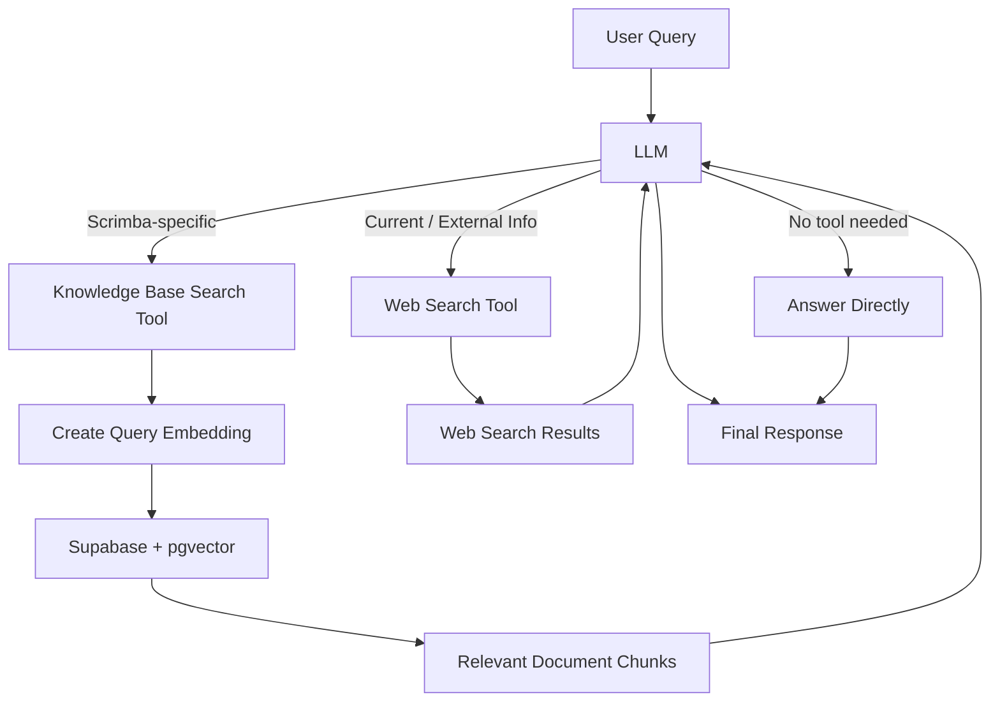
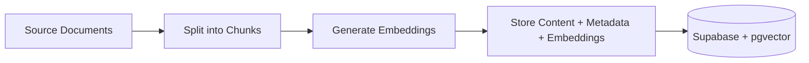

# Tool-Driven RAG with Web Search using Vercel AI SDK

A tool-driven AI assistant that combines **Retrieval-Augmented Generation (RAG)** with **web search**, allowing the model to decide which source of information it needs before answering.

Built with the **Vercel AI SDK**, OpenAI, Supabase, and pgvector, the assistant can:

- search a private Scrimba knowledge base for Scrimba-specific questions
- search the web for current or external information
- answer directly when no external information is required

This demonstrates a more idiomatic agentic approach than manually classifying and routing every query in application code.

## What This Demonstrates

- Tool calling with Vercel AI SDK
- Retrieval-Augmented Generation (RAG)
- Model-driven tool selection
- Multiple information sources
- OpenAI web search
- Custom knowledge-base tools
- OpenAI embeddings
- Vector similarity search with pgvector
- Supabase as a vector store
- System prompt design for tool usage
- Multi-step model execution

## Architecture



Rather than routing the request before generation, the model receives a set of available tools and chooses when to use them based on the user's question and the tool instructions.

## Tool-Driven Routing

The assistant exposes two tools:

### Knowledge Base Search

`knowledgeBaseSearch` is a custom Vercel AI SDK tool used for questions about Scrimba.

The tool:

1. receives a search query from the model
2. generates an embedding for that query
3. performs vector similarity search in Supabase
4. returns the most relevant document chunks to the model

The model can then use those retrieved documents as context for its answer.

### Web Search

The assistant also exposes OpenAI's web search tool for questions that require current or external information.

For example:

```text
What are the latest OpenAI models?
```

can trigger web search, while:

```text
How do I export code from Scrimba?
```

can trigger the Scrimba knowledge-base tool.

A general question that does not require external information can be answered directly.

## Why Use Tools Instead of Explicit Routing?

The previous RAG implementation classified every query into a predefined category before deciding which code path to execute.

In this version, the application instead provides the model with clearly defined tools:

```text
User Query
    ↓
LLM decides what it needs
    ├── Knowledge Base Search
    ├── Web Search
    └── Direct Answer
```

This keeps the orchestration closer to the model and makes it easier to extend the assistant with additional capabilities without continuously expanding application-level routing logic.

The model can also perform multiple steps when necessary before producing its final answer.

## Knowledge Base Ingestion

The Scrimba knowledge base uses the same RAG ingestion pipeline:



Documents are split into smaller chunks, converted into embeddings, and stored in Supabase.

At query time, the `knowledgeBaseSearch` tool retrieves semantically similar chunks using pgvector.

## Running Locally

### 1. Install dependencies

```bash
npm install
```

### 2. Create an OpenAI API key

Create an API key from the [OpenAI Platform](https://platform.openai.com/) and make sure the account has API billing or credits available.

### 3. Create a Supabase project

Create a project at [Supabase](https://supabase.com/).

Run the SQL scripts in the `sql` directory in order:

```text
sql/01-set-up.sql
sql/02-match-help-documents.sql
```

These scripts enable pgvector, create the knowledge-base table, and configure the vector similarity search function.

### 4. Configure environment variables

Create a `.env` file:

```env
OPENAI_API_KEY=your_openai_api_key
SUPABASE_URL=your_supabase_project_url
SUPABASE_API_KEY=your_supabase_api_key
```

### 5. Ingest the knowledge base

```bash
npm run seed
```

This reads the files from `docs`, splits them into chunks, generates embeddings, and stores them in Supabase.

### 6. Run the assistant

```bash
npm run start
```

Modify the query in `index.ts` to try different tool-selection paths.

For example:

```text
How do I export code from Scrimba?
```

should use the Scrimba knowledge base.

```text
What are the latest OpenAI models?
```

can use web search.

```text
What is the capital of France?
```

can be answered directly without invoking a tool.
