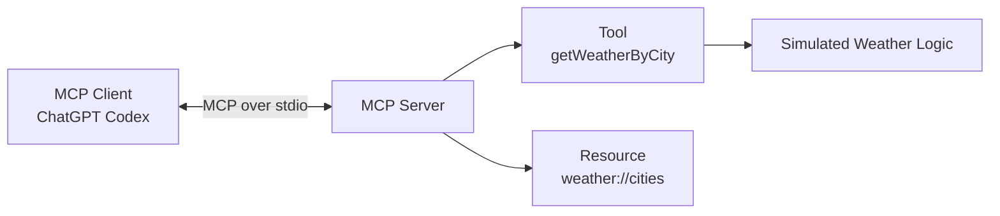
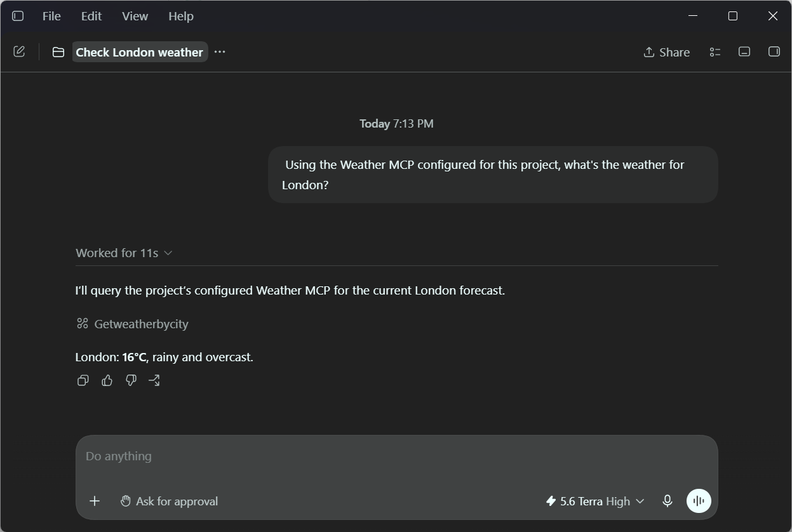

# MCP Server for AI Clients

A TypeScript implementation of a **Model Context Protocol (MCP) server** that exposes tools and resources to MCP-compatible AI clients.

The project focuses on the MCP architecture and integration flow rather than business logic. The weather data is deliberately simulated so the implementation can stay centered on how an AI client discovers and interacts with capabilities exposed through an MCP server.

It has been tested with:

- **ChatGPT Codex** as an MCP client
- **MCP Inspector** for inspecting and testing the server independently

## Architecture



The MCP server acts as a standardized interface between the AI client and application capabilities.

The client does not need to know how the underlying functionality is implemented — it discovers and interacts with the capabilities through MCP.

## Running Locally

### 1. Install dependencies

```bash
npm install
```

### 2. Build and start the MCP server

```bash
npm start
```

## Testing with MCP Inspector

[MCP Inspector](https://modelcontextprotocol.io/docs/2026-07-28/tools/inspector) provides a development interface for inspecting and invoking capabilities exposed by an MCP server.

```bash
npm run inspect
```

This builds the project and launches MCP Inspector against the server.

From the Inspector, you can inspect and test the exposed tool and resource without first integrating the server into an AI client.

## Using with ChatGPT Codex

The project includes a `.codex/config.toml` configuration that registers the server with Codex:

```toml
[mcp_servers.weather_mcp]
command = "npx.cmd"
args = [
  "tsx",
  "index.ts"
]
```

Once configured, Codex can discover the MCP server and use its exposed capabilities as part of a conversation.


